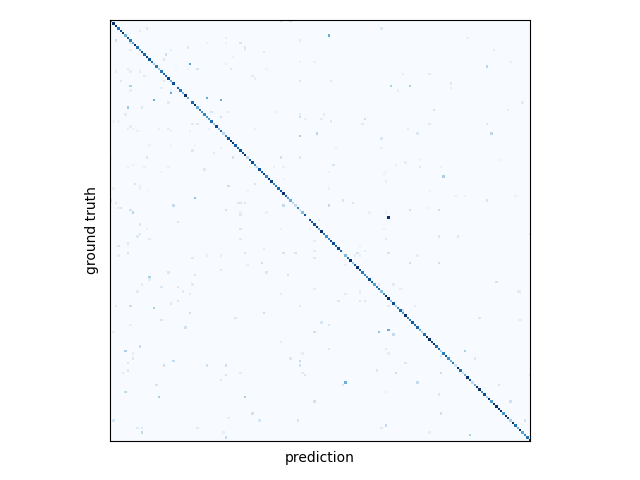

# AlexNet

```bibtex
@inproceedings{krizhevsky2012imagenet,
    author = {Krizhevsky, Alex and Sutskever, Ilya and Hinton, Geoffrey E},
    title = {ImageNet Classification with Deep Convolutional Neural Networks},
    booktitle = {Advances in Neural Information Processing Systems},
    pages={1097--1105},
    volume = {25},
    year = {2012}
}
```

## animeface-character-dataset

|model|top1|top5|process|confusion matrix|
|-|-|-|-|-|
|AlexNet|0.732|0.919|||

## ImageNet-Sketch

|model|top1|top5|process|confusion matrix|
|-|-|-|-|-|
|AlexNet|0.197|0.397|||
